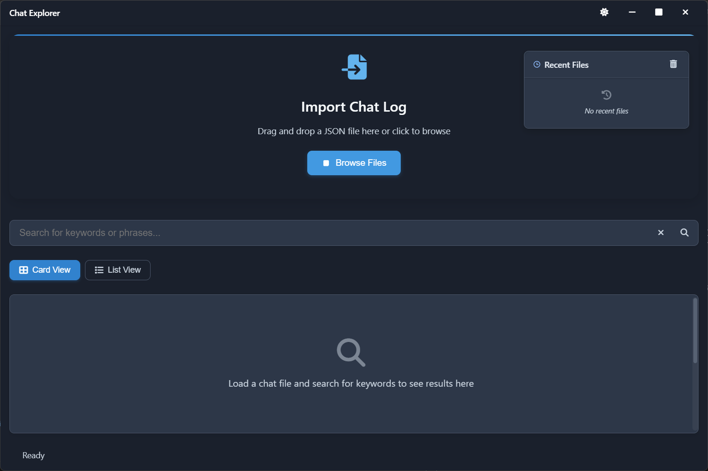
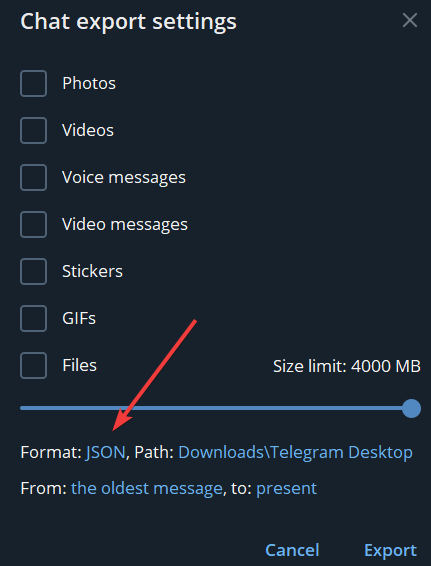
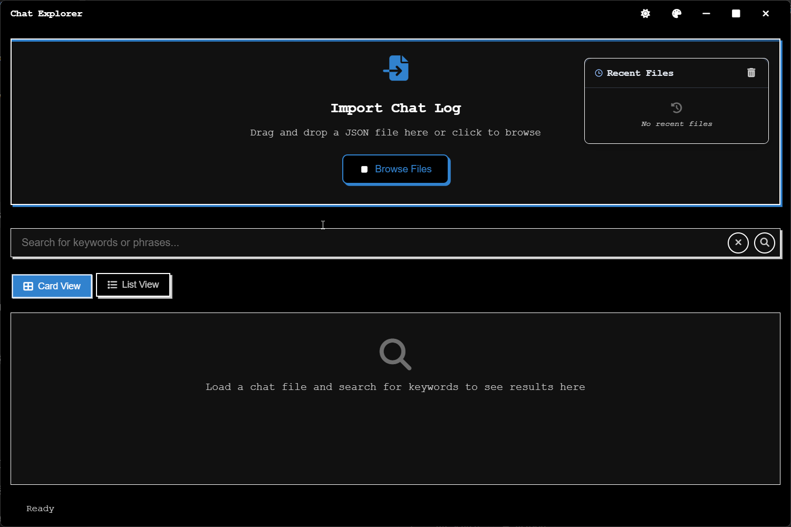

# Chat Explorer

[English](#english) | [中文](#chinese)

<a id="english"></a>

## Overview

Chat Explorer is a desktop application built with Electron that allows you to search and browse your chat history. It's designed for Telegram chat exports and other JSON chat logs.



## Features

- **JSON Chat Import**: Drag & drop or browse to load chat files
- **Advanced Search**: Find messages using keywords and exact phrases with quotation marks
- **Multiple Views**: Switch between card and list views
- **Conversation Context**: View messages before and after search results
- **Theme Options**: Multiple themes and color options available
- **Recent Files**: Quick access to previously opened chats
- **Copy to Clipboard**: Easy sharing of message content

## How to Export Telegram Chats

1. Open the chat in Telegram
2. Click the menu (⋮) > "Export Chat History"
3. Select JSON format
4. Download the file



## Getting Started

1. Download and install Chat Explorer from the releases section
2. Launch the application
3. Import a JSON file by dragging it or using "Browse Files"
4. Use the search bar to find messages

## For Developers

If you want to run the application from source:

1. Clone the repository
   ```
   git clone https://github.com/yourusername/chat-explorer.git
   cd chat-explorer
   ```

2. Install dependencies
   ```
   npm install
   ```

3. Run the application
   ```
   npm start
   ```

4. Build for your platform
   ```
   npm run build      # Build for all platforms
   npm run build:mac  # macOS only
   npm run build:win  # Windows only
   ```

---

<a id="chinese"></a>

# Chat Explorer

## 概述

Chat Explorer是一款桌面应用程序，基于Electron构建，可让您搜索和浏览聊天历史记录。它适用于Telegram聊天导出和其他JSON聊天日志。


## 功能特点

- **JSON聊天导入**：拖放或浏览加载聊天文件
- **高级搜索**：使用关键词和引号内精确短语查找消息
- **多种视图**：在卡片视图和列表视图之间切换
- **对话上下文**：查看搜索结果前后的消息
- **主题选项**：提供多种主题和颜色选择
- **最近文件**：快速访问先前打开的聊天记录
- **复制到剪贴板**：轻松分享消息内容

## 如何导出Telegram聊天记录

1. 在Telegram中打开聊天
2. 点击菜单(⋮) > "导出聊天历史"
3. 选择JSON格式
4. 下载文件



## 使用入门

1. 从releases部分下载并安装Chat Explorer
2. 启动应用程序
3. 通过拖放或使用"浏览文件"导入JSON文件
4. 使用搜索栏查找消息

## 开发者指南

如果您想从源代码运行应用程序：

1. 克隆存储库
   ```
   git clone https://github.com/yourusername/chat-explorer.git
   cd chat-explorer
   ```

2. 安装依赖
   ```
   npm install
   ```

3. 运行应用程序
   ```
   npm start
   ```

4. 为您的平台构建
   ```
   npm run build:mac  # 仅macOS
   npm run build:win  # 仅Windows
   ```